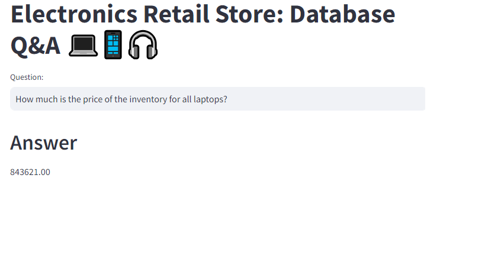

# **END-TO-END LLM Project Using Langchain, Google PaLM, and SQL**
## Retail Store: Query a Database with Natural Language

This end to end LLM project leverages the power of Google PaLM and LangChain to create a system that allows users to interact with a MySQL database using natural language queries. Ebadm Electronics, a retailer specializing in electronic items, maintains a comprehensive database of their inventory, sales, and discount information. This project aims to simplify data queries, enabling store managers to ask questions directly and receive answers without needing to write SQL queries.

## Project Overview

At the retail store where they maintain their inventory, sales and discounts data in MySQL database. A store manager may want to ask questions such as,
- How many black Apple smartphones do we have left in stock?
- If we have to sell all the Samsung electronic items today. How much revenue our store will generate without discount?

The system is intelligent enough to generate accurate queries for given question and execute them on MySQL database


- **Ebadm Electronics** focuses on selling electronic items from major brands.
- The store's inventory, sales, and discounts data are meticulously tracked in a **MySQL database**.
- We've developed a **Language Model (LLM)-based Question and Answer system** that integrates:
  - **Google PaLM LLM** for understanding and generating natural language queries.
  - **Hugging Face Embeddings** to capture the semantic meaning of queries.
  - **Streamlit** for a user-friendly web interface.
  - **LangChain** framework for seamless integration of LLM capabilities with database interactions.
  - **ChromaDB** as a vector store for efficient query processing.
  - **Few-shot learning** techniques to improve the system's understanding of domain-specific queries.
- Users, such as store managers, can input queries in natural language through a web UI, which the system then translates into SQL queries to fetch answers from the database.



### **Background**

#### *Introduction to LangChain*

LangChain is a open-source framework designed to facilitate the creation of applications driven by large language models (LLMs). It offers a flexible and expandable platform for integrating LLMs with various other elements, including modules for data retrieval, reasoning, and interactive agents. This framework simplifies the process of developing sophisticated applications powered by LLMs, such as chatbots, systems for answering questions from documents, and tools for analyzing code.

#### *Introduction to Google PaLM*

Google Palm is a state-of-the-art large language model developed by Google AI, designed to process and understand vast amounts of text and code. It is capable of producing written content, translating between languages, crafting various forms of creative writing, and providing detailed answers to queries, all based on its extensive training dataset.


## Installation and Setup

### 1. Clone the Repository

Clone the project repository to your local machine:

```bash
git clone https://github.com/Ebadm/End-to-End-LLM-Project-with-LangChain-SQL.git
```

### 2. Install the required dependencies using pip:

```bash
  pip install -r requirements.txt
```

### 3. Acquire an api key through makersuite.google.com and put it in .env file

```bash
  GOOGLE_API_KEY="your_api_key_here"
```

### 4. For database setup, run database/db_creation_ebadm_electronics in your MySQL workbench

## Usage

###  1. Run the Streamlit app by executing:
```bash
streamlit run main.py

```

###  2.The web app will open in your browser where you can ask questions

## Example Questions
- "How many Samsung headphones are currently in stock?" <br>
- "What will be the total revenue if we sell all laptops at the current discount rate?" <br>
- "List all the items with more than 20% discount." <br>
- "How many units of the grey iPhone are left in stock?" <br>

## Project Structure
- main.py: The main Streamlit application script.
- langchain_helper.py: This has all the langchain code
- requirements.txt: A list of required Python packages for the project.
- few_shots.py: Contains few shot prompts
- .env: Configuration file for storing your Google API key.
